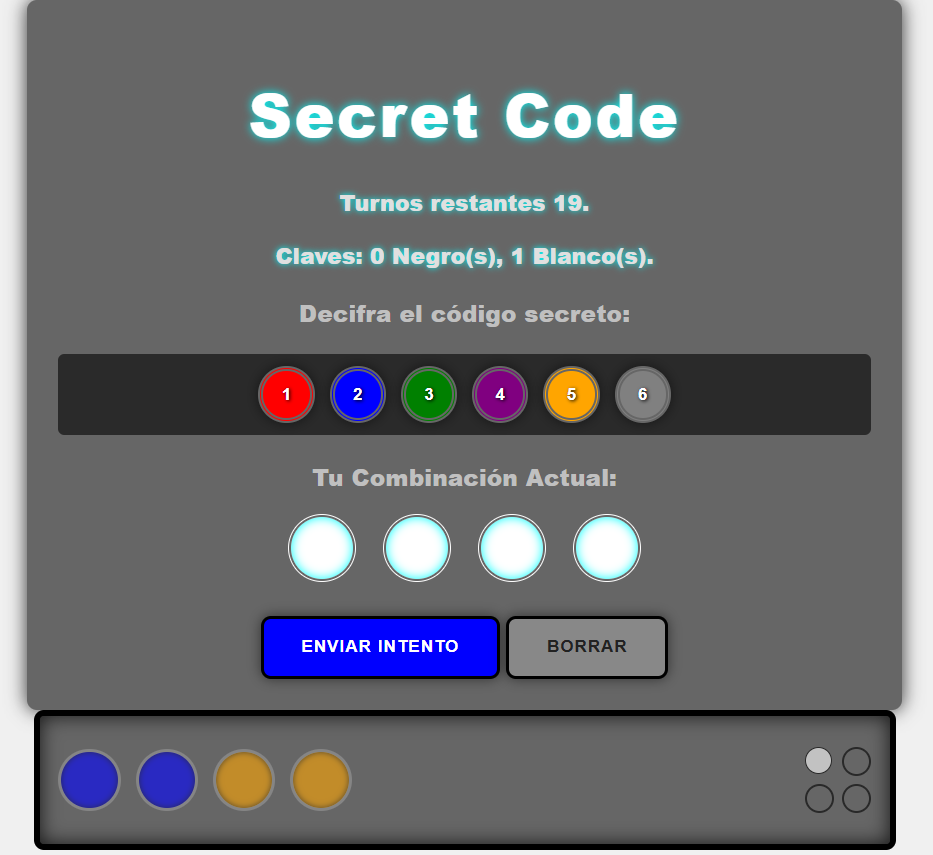
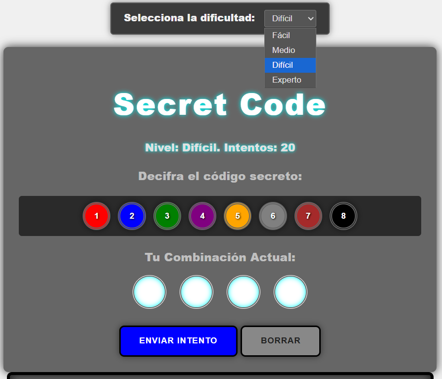

# 💻 Mastermind: De analogo a digital.
Este proyecto representa la digitalización del juego de mesa y desafío de lógica "Mastermind", migrando el algoritmo inicial de **Python** a una interfaz web interactiva desarrollada con tecnologías web **HTML, CSS, y JavaScript**.
### Despliegue GitHub Pages:
[Mastermind demo](https://cuackzoide.github.io/Mastermind/)

## Desarrollo de Lógica Core (V1)

* **Lenguaje:** **Python**
* **Función:** Implementación del **algoritmo de generación de código aleatorio** (`random`) y las funciones de **comparación de jugadas**.
* **Métrica de Feedback:** Uso de **estructuras condicionales** para calcular el *feedback* preciso (**aciertos de color y posición**), con comprobaciones de victoria/derrota.
* **Entorno:** Ejecución inicial verificada y funcional a través de la **Terminal/CLI**.
* **Prueba:** Corre el programa en tu terminal o dentro de tu editor de codigo y sigue las instrucciones. 
Si consigues blancos, significa que acertaste el color. Si consigues negros, significa que acertaste tambien la posición!.
* **Objetivo:** Tu elección sea identica al codigo secreto, obteniendo los 4 pines negros para ganar!.

## Interfaz Web JavaScript (V2)

* **Lenguajes/Frameworks:** **HTML5, CSS3, JavaScript**
* **Proceso Clave:** **Transpilación y Refactorización** de la lógica *core* de Python a JavaScript.
* **Front-End:** Creación de la **Interfaz de Usuario (UI)** del tablero de juego. Se empleó **CSS** para el diseño y **JS** para la **Manipulación del DOM**, la gestión de eventos y la validación de jugadas.
* **Funcionalidades Añadidas:** Implementación de un **Selector de Niveles de Dificultad** y utilidades para la **Gestión de Estado** (corrección de jugadas y reset).

## 🚀 Pruebas y QA
Se realizaron **pruebas funcionales (QA)** en el entorno del navegador para garantizar la correcta ejecución de la lógica, la interactividad del tablero y la precisión del *feedback* tras cada intento.
Puedes descomentar la linea 56 del archivo *script.js* para obtener un *console.log* del resultado y comprobar las iteraciones de *random*.

